# ⚔️ K-Pulse 친구 도전장 & 빠른 답 점수 시스템 기술 문서 (Friend Challenge Specification)

> **문서 상태**: 공식 기술 명세서 (Living Technical Document)  
> **최초 작성일**: 2026-10-09  
> **버전**: v1.0.0 (Phase 1 완료)  
> **프로덕션 서비스**: [https://kpulsequiz.com](https://kpulsequiz.com)  
> **저장소**: [https://github.com/camoes666/korean-quiz](https://github.com/camoes666/korean-quiz)  

---

## 1. 개요 및 목적 (Overview & Goals)

본 시스템은 **서버 및 데이터베이스 비용 0원(Serverless 100% Static HTML Export)** 환경에서 동작하는 **비동기 1:1 친구 대결(P2P Friend Challenge) 및 빠른 응답 점수(Speed-based Scoring) 시스템**입니다.

### 1.1 해결하고자 한 문제
1. **정적 사이트의 소셜 바이럴 한계**: 기존에는 유저가 퀴즈를 풀고 점수를 소셜 미디어(X, 레딧)에 텍스트로만 공유하여, 링크를 클릭한 친구가 자신만의 별도 세션으로 들어갈 뿐 유저 간의 실질적인 경쟁심을 자극하지 못했습니다.
2. **세션 피로도**: 과거 10문제 고정 풀이 방식은 모바일 유저에게 세션 길이가 길어 이탈률이 높았고, 친구 간 즉각적인 재대결(되받아치기) 루프를 만들기 어려웠습니다.
3. **단순 정답률 기반 점수의 단조로움**: 맞힌 개수만으로는 동점자가 다수 발생하여 우열을 가리기 어려웠습니다.

### 1.2 핵심 달성 목표
- **5문제 집중형 세션**: 재플레이성과 바이럴 회전율을 극대화한 5문제 고정 체제.
- **번개손(0.1초 단위) 스피드 점수**: 문제당 최대 1,000점, 세션당 최대 5,000점 만점 설계.
- **DB 없는 URL 기반 대결 페이로드**: 5문제 ID, 각 문제별 획득 점수, 닉네임, FNV-1a 무결성 해시를 URL 쿼리 파라미터(`?c=...`) 하나에 패킹.
- **실시간 대결 HUD & 결과 비교표**: 도전받은 유저가 문제를 풀 때마다 실시간 누적 점수차(`+앞섬`, `-뒤짐`, `동점`)를 체감하고, 종료 후 1~5라운드 점수표 및 승/패/무 결과를 즉시 확인.
- **되받아치기(Counter-Attack) 바이럴 루프**: 패배하거나 승리한 유저가 즉시 새로운 5문제로 친구에게 되받아치는 원클릭 공유.

---

## 2. 전체 시스템 아키텍처 (System Architecture)

```mermaid
flowchart TD
    subgraph A["도전자 (A: Challenger)"]
        A1["퀴즈 시작 (5문제 랜덤 출제)"] --> A2["0.1초 단위 응답 시간 측정"]
        A2 --> A3["문제별 스피드 점수 계산<br/>(scoring.ts: 0 ~ 1,000점)"]
        A3 --> A4["5라운드 완료 후 총점 결산<br/>(예: 4,250 / 5,000 pts)"]
        A4 --> A5["닉네임 입력 (최대 12자)<br/>localStorage.kpulse_nickname"]
        A5 --> A6["도전장 생성<br/>encodeChallenge(slug, data)"]
        A6 --> A7["도전장 링크 복사 & SNS 공유<br/>https://kpulsequiz.com/quiz/slug?c=PAYLOAD"]
    end

    subgraph B["도전받는 친구 (B: Competitor)"]
        B1["?c= 링크 접속"] --> B2["URL 파라미터 감지 & 디코딩<br/>decodeChallenge(slug, c)"]
        B2 -->|위변조 감지 / 불일치| B3_ERR["오류 안내 배너 노출<br/>일반 모드로 자동 전환"]
        B2 -->|무결성 검증 통과| B3["1:1 대결 모드 활성화<br/>A와 동일한 5문제/순서 세팅"]
        B3 --> B4["A vs B 실시간 점수차 HUD 노출<br/>(+앞섬 / -뒤짐 / 동점)"]
        B4 --> B5["결과 화면: ChallengeResult<br/>승리👑 / 패배😢 / 무승부🤝"]
        B5 --> B6["1~5라운드 상세 점수 비교표"]
        B6 --> B7["'되받아치기 도전장' 생성하여<br/>A 또는 단체방에 재공유"]
    end
```



---

## 3. 핵심 모듈별 상세 기술 명세 (Technical Details)

### 3.1 스피드 점수 엔진 (`src/lib/scoring.ts`)

#### 1) 점수 산출 공식
각 문제당 기본 제한 시간은 **15초**이며, 문제당 만점은 **1,000점**입니다.

$$\text{점수} = \operatorname{round}\left(500 + 500 \times \frac{\min(\text{남은초}, 15)}{15}\right)$$

- **정답 즉시 제출 (15초 남음)**: $500 + 500 = 1,000\text{점}$ (만점)
- **종료 직전 제출 (0초 남음)**: $500 + 0 = 500\text{점}$ (기본점)
- **7.5초 남은 시점 정답**: $500 + 250 = 750\text{점}$
- **오답 또는 시간 초과 (0초)**: $0\text{점}$

#### 2) 파워업 아이템 감점 및 보정
- **어시스트 감점 (50:50 찬스 또는 힌트 사용 시)**: 정답을 맞히더라도 최종 획득 점수의 **50% 감점** ($\operatorname{round}(\text{점수} / 2)$).
- **시간 연장 아이템 (+10초)**: 제한 시간이 25초로 늘어나 남은 시간이 15초를 초과하더라도, $\min(\text{남은초}, 15)$ 규칙에 의해 **1,000점 상한(Cap)**이 엄격하게 유지됩니다.

#### 3) 세션 스펙
- 문제 수: **5문제** 고정
- 세션 만점: **5,000점**
- 경험치(XP) 및 스트릭: 기존 게이미피케이션(정답당 20 XP, 완주 보너스 30 XP, 퍼펙트 50 XP)과 독립적으로 점수 산출.

---

### 3.2 도전장 암호화 & 직렬화 엔진 (`src/lib/challenge.ts`)

서버 없이 브라우저 간 대결을 보장하기 위해 경량 FNV-1a 해시와 Base64 URL-safe 인코딩을 적용했습니다.

#### 1) 페이로드 데이터 스키마
```ts
interface ChallengePayload {
  v: number;      // 버전 (1)
  q: number[];    // 출제된 5문제 ID 배열 (길이 5)
  p: number[];    // 도전자 획득 점수 배열 (길이 5, 각 0~1000)
  n: string;      // 도전자 닉네임 (최대 12자)
  h: string;      // FNV-1a 32비트 검증 해시 (Base36 인코딩)
}
```

#### 2) 경량 FNV-1a 32-bit 무결성 해시
- **Salt**: 고정 솔트 `'kpulse-ch-v1-salt'` 사용
- **해시 대상 원문**: `${slug}:1:${q.join(',')}:${p.join(',')}:${nickname.trim()}:${SALT}`
- **알고리즘**:
  - 오프셋 베이시스: `0x811c9dc5`
  - FNV 소수: `0x01000193`
  - UTF-8 바이트 단위 XOR 및 곱셈 연산 후 32비트 부호 없는 정수를 `(hash >>> 0).toString(36)`으로 변환.

#### 3) UTF-8 안전 Base64 URL-safe 인코딩
- 단순 `btoa()` / `atob()`는 한글 및 이모지(예: "지민바라기🐥")에서 `InvalidCharacterError`가 발생합니다.
- `encodeURIComponent` ➔ 이진 문자열 ➔ `btoa` 변환 후 `+` ➔ `-`, `/` ➔ `_`, `=` 패딩 제거를 적용하여 전 세계 언어 및 특수문자를 완벽 지원합니다.

#### 4) 위변조 방지 및 안전 Fallback
- `decodeChallenge` 실행 시:
  - 버전 `v !== 1` 검증
  - 문제 수 `q.length !== 5`, 점수 수 `p.length !== 5` 검증
  - 각 점수의 정수형 및 범위(`0 <= pts <= 1000`) 검증
  - 해시 불일치 시 즉시 `null` 반환
  - 퀴즈 슬러그와 다른 퀴즈의 토큰을 교차 사용했을 경우 불일치로 `null` 반환
  - 퀴즈 문제은행에서 5개 문제를 모두 찾지 못할 경우 일반 모드로 안전 복구

---

### 3.3 UI 컴포넌트 아키텍처

#### 1) `ChallengeBanner.tsx`
- **`mode="intro"`**: `?c=` 링크로 진입했을 때 도전자 이름과 목표 점수를 노출하며 "도전 수락하고 대결하기" 버튼 제공.
- **`mode="in-game"`**: 퀴즈 진행 중 상단 HUD에 A의 동 회차 누적 점수와 내 누적 점수를 실시간 비교 (`+{diff}점 앞서는 중!`, `-{diff}점 뒤처지는 중...`, `동점!`).
- **`mode="error"`**: 만료되거나 변조된 링크로 접근했을 때 사용자에게 경고 배너를 띄우고 일반 모드로 원활하게 전환.

#### 2) `ChallengeResult.tsx`
- **A vs B 승/패/무 엠블럼**: 승리(👑), 패배(😢), 무승부(🤝)를 대형 카드로 시각화.
- **라운드별 상세 점수표**: 1~5라운드 문제별 점수 격차 및 승패 뱃지(`승`, `패`, `무`) 제공.
- **되받아치기 버튼**: 클릭 시 새로운 5문제 도전 링크를 즉시 생성하여 클립보드에 복사하고 토스트 안내.
- **일반 모드로 다시 하기**: URL 쿼리 파라미터를 `window.history.replaceState`로 깔끔하게 정리.

#### 3) `ShareButtons.tsx`
- **닉네임 입력 폼**: `localStorage.kpulse_nickname`에 자동 동기화되어 다음 방문 시에도 유지.
- **5,000점 만점 문구 생성**: 트위터(X), 레딧, 클립보드 복사 문구에 총점(예: `4,250점`)과 함께 도전장 URL 자동 결합.

#### 4) `QuizRunner.tsx` & `page.tsx`
- **Next.js 16 Static Export 최적화**: `useSearchParams()`를 안전하게 사용하기 위해 `page.tsx`에서 `<QuizRunner>`를 `<Suspense>` 경계로 래핑.
- **React 19 순수 렌더링 준수**: `useRef(0)`와 `useMemo` 기반 상태 유도, `popstate` 리스너를 통한 `react-hooks/set-state-in-effect` 린트 규칙 100% 준수.

---

## 4. 다국어 지원 (i18n Localization)

지원 언어 5개 국어(`en`, `es`, `ko`, `ru`, `zh`) 전반에 도전장 사전 키를 구현 완료하였습니다:

| 사전 키 | 한국어 (`ko`) | 영어 (`en`) | 스페인어 (`es`) |
|---|---|---|---|
| `introTitle` | ⚔️ {nickname}님의 도전장! | ⚔️ Challenge from {nickname}! | ⚔️ ¡Desafío de {nickname}! |
| `introDesc` | {score}점을 넘을 수 있을까요? | Can you beat {score} pts? | ¿Puedes superar {score} pts? |
| `startBattle` | 도전 수락하고 대결하기 | Accept Challenge & Start | Aceptar Desafío y Jugar |
| `scoreLead` | +{diff}점 앞서는 중! | +{diff} pts ahead! | ¡+{diff} pts adelante! |
| `scoreBehind` | -{diff}점 뒤처지는 중... | -{diff} pts behind... | -{diff} pts atrás... |
| `win` | 승리! 👑 | Victory! 👑 | ¡Victoria! 👑 |
| `lose` | 패배... 😢 | Defeat... 😢 | Derrota... 😢 |
| `tie` | 무승부! 🤝 | It's a Tie! 🤝 | ¡Empate! 🤝 |
| `counterAttack`| 되받아치기 도전장 보내기 | Send Counter Challenge | Enviar Contraataque |

---

## 5. 단위 테스트 및 검증 결과 (Test & QA)

### 5.1 테스트 환경 (Vitest)
Next.js 16 + React 19 환경에서 순수 수학 로직 및 비즈니스 무결성을 검증하기 위해 `vitest`를 설정하였습니다.

```bash
# 전체 단위 테스트 실행
npm test
```

### 5.2 테스트 커버리지 (총 22개 테스트 통과)
1. **점수 계산 엔진 (`src/lib/__tests__/scoring.test.ts` - 9개 테스트)**:
   - 15초(즉시) 정답 시 1,000점 만점
   - 0초 남은 정답 시 500점 기본점
   - 7.5초 정답 시 750점 및 반올림 검증
   - 50:50 또는 힌트 찬스 사용 시 50% 감점(250점, 500점)
   - 오답 또는 시간 초과 시 0점
   - +10초 파워업으로 남은 시간이 15초를 초과해도 1,000점 상한(cap) 적용
   - 누적 총점 계산(`calcTotalPoints`) 정상 합산

2. **도전장 직렬화 & 해시 (`src/lib/__tests__/challenge.test.ts` - 13개 테스트)**:
   - 정상 인코딩 ➔ 디코딩 왕복 정합성
   - 점수 위변조(점수 조작) 시 해시 불일치로 `null` 반환
   - 타 퀴즈 슬러그 도용 시 `null` 반환
   - 한글 닉네임("홍길동", "지민바라기🐥") 및 특수문자 직렬화 무결성
   - 문제 ID 5개 매핑 및 유효성 검증

---

## 6. 빌드 및 배포 파이프라인 이슈 해결 기록 (Troubleshooting)

### 이슈 1: Cloudflare Pages `npm ci` ERESOLVE 의존성 충돌
- **증상**: 로컬 `npm run build`는 성공하나, GitHub `main` 푸시 시 Cloudflare Pages가 0초 만에 `🚫 Build failed` 반환.
- **원인**: Cloudflare 컨테이너가 배포 시작 시 `npm ci`를 실행하는데, 루트 프로젝트의 `@types/node@^20`과 `vitest@5.0.3`의 peer dependency 범위 충돌 발생.
- **해결**: 루트에 [`.npmrc`](file:///C:/Users/USER/code/quiz_site/.npmrc)를 생성하고 `legacy-peer-deps=true`를 선언. Cloudflare Pages의 `npm ci`가 정상 통과하며 `✅ Deploy successful!` 달성.

### 이슈 2: Next.js 16 정적 Export에서 `useSearchParams` Suspense 누락
- **증상**: `output: 'export'` 환경에서 빌드 타임 정적 페이지 생성 실패 위험.
- **해결**: `src/app/quiz/[slug]/page.tsx`에서 `<QuizRunner>`를 `<Suspense>` 경계로 래핑하여 정적 페이지 28개 전체 프리렌더링 통과.

---

## 7. 향후 확장 로드맵 (Roadmap)

1. **Phase 2 (세로형 이미지 카드 자동 생성)**
   - 퀴즈 완료 시 "I'm a LEGEND STAY 👑 4,250 pts" 형태의 1080×1920 세로형 인스타그램 스토리 / 틱톡용 캔버스 이미지 저장 버튼 제공.
2. **Phase 3 (Cloudflare D1 연동 실시간 랭킹)**
   - 원할 경우 주간/월간 최고 번개손 점수를 글로벌 순위표에 닉네임과 함께 실시간 등록 (Cloudflare Workers + D1).
